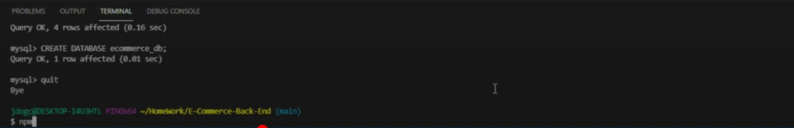
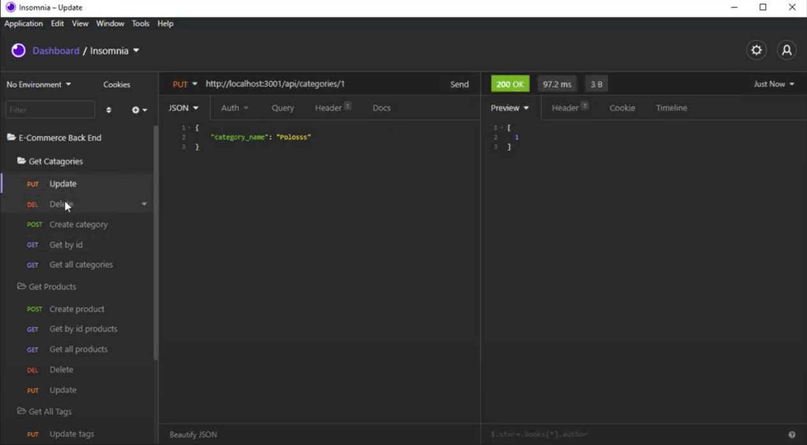

<h1 style="text-align: center;">Employee Manager</h1>

[[Demo-Video]](https://youtu.be/mAYQsOPOzaQ)

[[Preview]](#Preview)

## General overview: 

 
For this project my goal was to create a E-Commerce-Back-End that will allow the front end to modify a database using, get, post, put and delete request. This was tested using insomnia using a local host through node express. Using a series of commands in sql shell and node you can quickly get the server setup for yourself. I built api routes in JavaScript using express and modules for the basic setup. I also used sequelize to build out my models. After seeding, and starting the server using bash terminal you can send, receive, update & delete items in the database.

<h3 style="text-align:center;">Instructions</h3>

1. Install required packages in bash terminal using `npm install`
2. Run the seed command to populate the database using bash terminal `npm run seed`
3. Start the server using bash terminal `npm run start`. The server will be running once you see app listening in the terminal
4. Open insomnia and make get, post, put and delete request.

<h3 style="text-align:center;">JS-Summary</h3>

* Added Packages needed for the application
* Added database seed
* Added gitignore
* Added get route for category with findAll method
* Added get route for category with findByPk method
* Added post route for category with create method
* Added put route for category with update method
* Added delete route for category with destroy method
* Added get route for product with findAll method
* Added get route for product with findByPk method
* Added post route for product with create method
* Added put route for product with update method
* Added delete route for product with destroy method
* Added get route for tag with findAll method
* Added get route for tag with findByPk method
* Added post route for tag with create method
* Added put route for tag with update method
* Added delete route for tag with destroy method
* Added model for productTag
* Added model for product
* Added model for category
* Added model for tag

>Notes: A lot of pattern matching for this project! I enjoyed the challenge :)

## Preview

